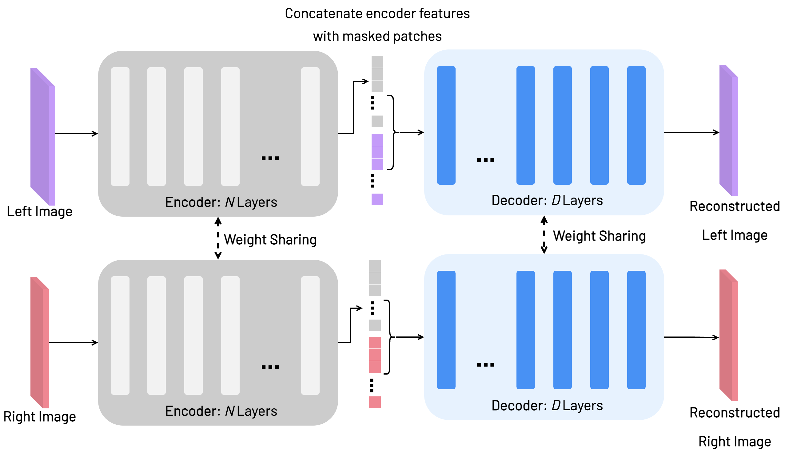
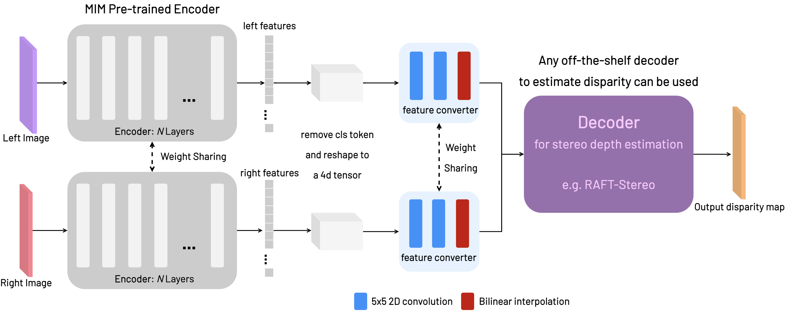

# Masked Auto Encoder for Stereo Depth Estimation

Official code for the paper [Generalisable Stereo Depth Estimation with Masked Image Modelling]()

## Structure 🏗️

```
├── configs               # All the configs related to the models & training runs
│    └── ...              # (includes hyper parameters and args)
|
├── docker                # files associated creating both the docker image & container
|    └── ... 
|
├── src                   # All files for datasets and models & third party stuff
|    └── ...              # third party stuff includes external repos for stereo models i.e. RAFTstereo
|                         # also includes utility files
|
├── arguments.py          # has main dot list commands for defining paths to configs
├── test.py               # script for testing
└── train.py              # script for training   
```

## Set Up 💿

You can install the docker image or via python virtual env (no docker), both are possible.

### Docker 🐋

1. Build Docker Image: **If `mae_stereo_v3` image already exists skip this step**. 
You can check by typing `docker images` in the terminal.
if you are using a new instance then first build the mae_stereo_1 docker image:
  ```
  cd ./docker
  sh build.sh
  ```
  This should build an image entitled: `mae_stereo_v3`. 

2. Create your Docker container, whilst in the same directory (`./docker`):
  ```
  sh start.sh
  ```
Then you are set to go!

**Note: sometimes you need sudo access to run docker; to prevent having to do that everytime, run the following in terminal"**
```shell
sudo usermod -aG docker $USER
```

### Python virtual environment 🐍 (not via docker)

1. Create your python / conda virtual environment. Install [PyTorch](https://pytorch.org/get-started/locally/) for your specific hardware configuration
2. Activate your python / conda virtual environment. Then install the following additional requirements (pip install overcomes version conflicts):
  
  ```shell
  pip install -r requirements.txt
  ```

### Running a Notebook on a Remote Server in Docker Container
1. On the remote machine, start jupyter notebook from your current directory and specify the port:
```shell
jupyter notebook --no-browser --port=9999
```
2. On the local machine, catch the forwarded port:
```shell
ssh -NfL localhost:9999:localhost:9999 your_user_name@remote_ip_address
```
3. copy and paste the link created by the jupyter notebook on the remote server onto your browser, for example:
```shell
http://localhost:9999/?token=$SOME-RANDOM-TOKEN-NUMBER
```

### Instructions on how to download the datasets 💾 are presented in: [Dataset Download Readme](DatasetDownload.md)

## Third Party Repo Integration
To experiment with different stereo models, simply git clone your favourite stereo model respository in the `./src/third_party/$repo_name` directory. You can then directly create function calls to their code snippets in your environment. **For example RAFTStereo**:
  
  ```shell
  git clone https://github.com/princeton-vl/RAFT-Stereo ./src/third_party/raft_stereo
  ```
**‼️ Note, you don't need to integrate RAFT-stereo, since its modules are already part of this repository.**

### Overview 👁️
The following describes the overall method.
This work is based on masked image modelling, in particular the following 2 papers: [MAE](https://arxiv.org/abs/2111.06377), [VideoMAE](https://arxiv.org/abs/2203.12602) and [RAFTStereo](https://arxiv.org/pdf/2109.07547.pdf).

This work follows a 2 stage process:
1. Pre-training a ViT encoder-decoder model to reconstruct masked stereo images (similar to VideoMAE; we use the same masking strategy). The following figure illustrates this:

2. We take the pre-trained ViT model for downstream fine tuning for stereo depth estimation. In particular we take the pre-trained ViT encoder model from (1) (we don't need the decoder), and replace the decoder with a decoder for stereo-depth estimation. I currently experiment with RAFTStereo's decoder. Though, any other decoder can be used; based on user's choice. The following figure illustrates this.

Then we fine tune the full model for stereo depth estimation via supervised learning (same loss as RAFT Stereo) i.e. (ViT encoder > RAFTStereo decoder = Stereo depth estimation).

## Training 🏋️
To train the model, simply call the right configs and use the `train.py` file. Here's an example:
```shell
  python train.py --dataset_config $path_to_config --model_config $path_to_config
```
Your config files should incorporate all the details for conducting your training run, and you can create new configs for different experiments, allowing easy sharing of your experiments.
**Note: make sure you have provided the right directories for your datasets in the `dataset configs`**

Similarly an example for pre-training the StereoMAE using masked image modelling:
```shell
  python train.py --dataset_config '/configs/data/pretrain_all.yaml' --model_config '/configs/models/stereomae.yaml'
```
**The settings for the devices / batch size etc. is defined in the `/configs/default.yaml`** This allows args / hyper params to be separated for different components. You can also edit the yaml directly form the command line, without having to physically edit the yaml files, for example:
```shell
  # overview:
  python train.py $config_name.$entry=$new_value
  # example, changing batchsize and using 0 as the GPU device id:
  python train.py training.batch_size=16 training.trainer.gpus=[0]
```

## Testing 🏃‍♂️
This code needs to be developed.

## Model Checkpoints 🚩
Checkpoints of pre-trained weights can be found here:

**The following are the weights for the trained ViT encoder-decoder model from MIM pre-training**
| Loss  |   File Link   |
| -------------  | ------------- |
| MSE  | [StereoMAE_MSEloss](https://imperiallondon-my.sharepoint.com/:u:/g/personal/st2617_ic_ac_uk/EVw7Yf9OBolDrbRfs9NrAlcBJKgvq2ghP0be3YkZKjlI4w?e=9G6Kl6)  |
| Perceptual   | [StereoMAE_Perceptualloss](https://imperiallondon-my.sharepoint.com/:u:/g/personal/st2617_ic_ac_uk/EbdItp207jROoI7IRldMh88BwySB3wnqjeGH7BXerGhXzw?e=3MDkzW)  |
| SSIM   | [StereoMAE_SSIMloss](https://imperiallondon-my.sharepoint.com/:u:/g/personal/st2617_ic_ac_uk/EaCQVpHHZ-1EhY30x49UlgABjoPkF7IRTaYAIF4N2C29Hg?e=ELdgJ0)  |

**The following are the weights for the trained downstream StereoMAE model from supervised disparity estimation**
| Data  | MIM Loss (pre-trained)  | File Link   |
| -------------  | ------------- | ------------- |
| SceneFlow  | Perceptual | [StereoMAE_sceneflow_perceptual]()  |
| SceneFlow  | MSE | [StereoMAE_sceneflow_mse]()  |
| SceneFlow  | N.A (supervised ImageNet OG weights) | [StereoMAE_sceneflow_imagenet]()  |
| ETH3D   | Perceptual | [StereoMAE_eth_perceptual]()  |
| Middlebury   | Perceptual | [StereoMAE_middlebury_perceptual]()  |
| All-synthetic-pre-training  |  Perceptual | [StereoMAE_all_perceptual]()  |

## Acknowledgements 👏

This repository is inspired by code based on the following repositories: 
- [MAE](https://github.com/facebookresearch/mae)
- [RAFT-Stereo](https://github.com/princeton-vl/RAFT-Stereo)
- [MonoDepth](https://github.com/mrharicot/monodepth)
- [RandNN Depth](https://github.com/CVRS-Hamlyn/Randomly-Connected-Neural-Network-for-Self-Supervised-Monocular-Depth-Estimation)
- [MMF](https://github.com/facebookresearch/mmf)

Thanks so much to their contributors for open sourcing their code! 🎉 your work has fuelled the development of this research